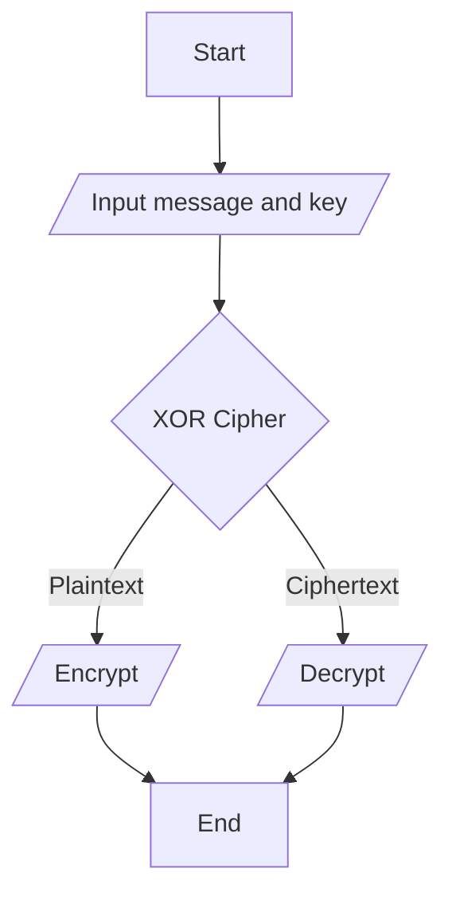

# Program

Search Tag(s): #cryptography #symmetric

## Flowchart



## Pseudo Code

### Single XOR Cipher

```vb
function single_byte_xor(plaintext, key)
    ciphertext := ""
    
    for each character in plaintext
        char := character XOR key
        ciphertext := ciphertext + encrypted_char
    
    return ciphertext

plaintext := "Attack At Dawn!"
key := 10

encrypt := single_byte_xor(plaintext, key)
print "Encrypted text: " + encrypt

decrypt := single_byte_xor(encrypt, key)
print "Decrypted text: " + decrypt
```

---
## References

- [Codementor: Deciphering Single-byte XOR Ciphertext](https://www.codementor.io/@arpitbhayani/deciphering-single-byte-xor-ciphertext-17mtwlzh30)

- [GeeksForGeeks: XOR Encryption by Shifting Plaintext](https://www.geeksforgeeks.org/xor-encryption-shifting-plaintext/)

- [Adeolu Olabode Afolabi: Improve Data Security Using Modified XOR Encryption Algorithm](https://www.researchgate.net/publication/270588628_AN_APPROACH_TO_IMPROVE_DATA_SECURITY_USING_MODIFIED_XOR_ENCRYPTION_ALGORITHM)